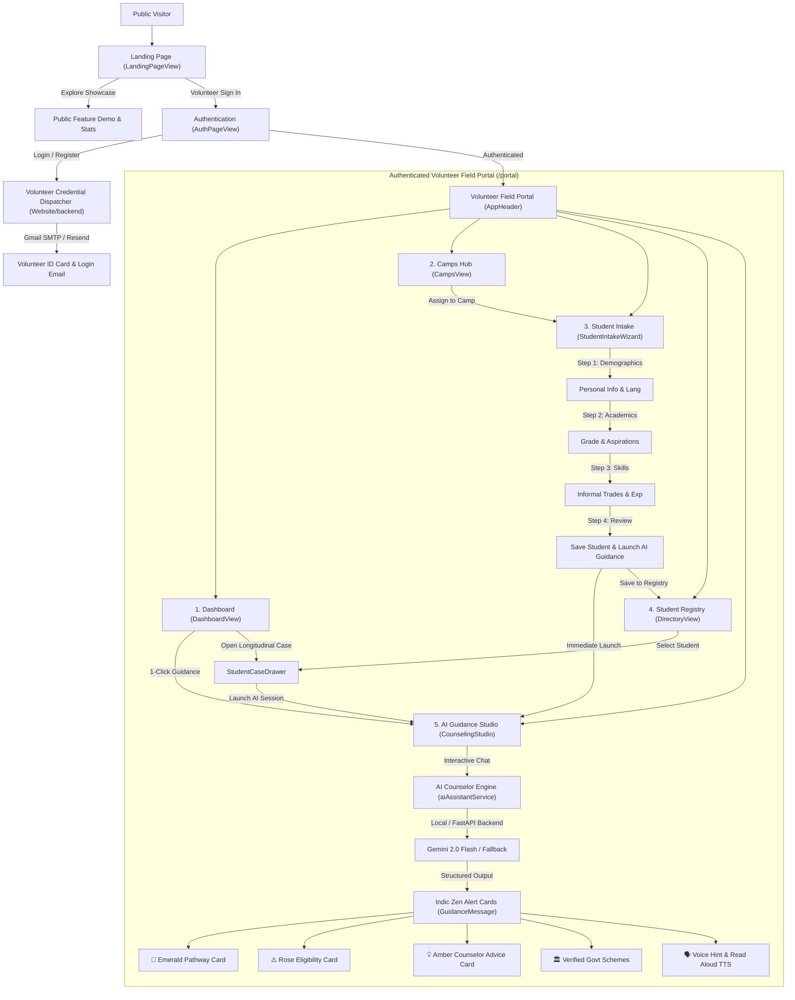
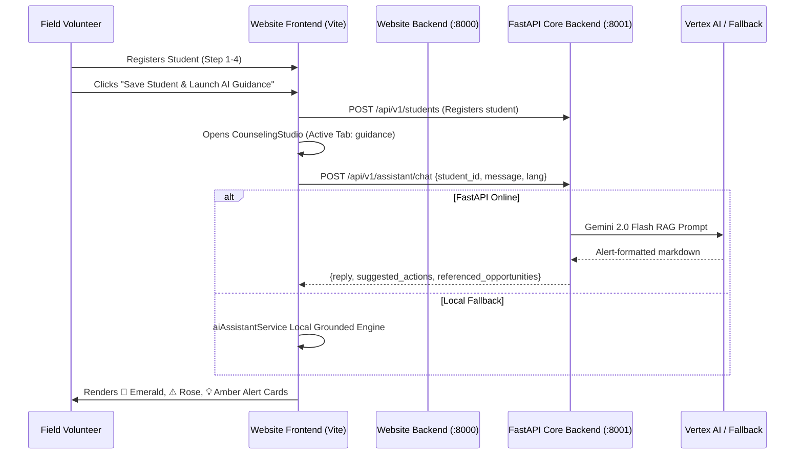

# DreamCatcher Website — End-to-End System Workflow



---

## 1. Top-Level View States

The website utilizes a 3-tier view router managed in `Website/frontend/src/App.jsx`:

```text
Landing Page ('landing') ──> Auth Split-Screen ('auth') ──> Volunteer Portal ('portal')
```

### State 1: Public Landing Page (`LandingPageView`)
- **Default entry URL**: `http://localhost:5173/` or `/#try-it`
- **Purpose**: Public-facing showcase designed to introduce DreamCatcher to field volunteers, NGOs, and educational officers.
- **Key Elements**:
  - Hero header with rural career counseling mission.
  - Interactive metrics banner (Students reached, active districts, placement rate).
  - Call to Action buttons: **"Start Field Session"** (opens Auth/Portal) and **"Explore Public Demo"**.

### State 2: Volunteer Authentication (`AuthPageView`)
- **Purpose**: Split-screen authentication for field volunteers and district coordinators.
- **Features**:
  - **Login**: Email + Password or Volunteer ID.
  - **Registration**: Captures Name, District, NGO/Institution, and Contact.
  - **Credential Dispatching**: Automatically dispatches official credentials to the volunteer's inbox via Gmail SMTP App Password or Resend API.
  - Quick toggle button `← Back to Home`.

---

## 2. Authenticated Field Portal (`portal`)

Once authenticated, the volunteer enters the **Volunteer Field Portal**, unified by:
- **Floating iOS Glass Navbar (`AppHeader.jsx`)**: Tab switcher, language selector, district badge, volunteer profile badge.
- **Offline Sync Status Bar (`SyncStatusBar.jsx`)**: PWA offline indicator showing local caching status for field camps without internet.

The Portal is organized into **5 core operational tabs**:

---

### Tab 1: Dashboard (`DashboardView`)
The analytical command center for field operations.
- **Quick Metrics**:
  - *Students Counseled* (count)
  - *Active Field Camps* (ongoing village camps)
  - *Opportunities Matched* (scholarships & recruitment schemes)
  - *Average Readiness Index* (student qualification score)
- **Regional Reach Chart**: Visual breakdown of student coverage across Maharashtra districts (*Satara, Kolhapur, Sangli, Pune, Solapur*).
- **Recent Student Cases**: Feed of recently onboarded students with quick-action buttons to open their case drawer or immediately launch counseling.

---

### Tab 2: Camps Hub (`CampsView`)
Manages village and rural school outreach initiatives.
- **Camp Directory**: Lists active, scheduled, and past outreach camps with dates, coordinator details, and target school/panchayat.
- **Contextual Intake**: Clicking **"Start Intake at this Camp"** binds all subsequent student registrations to that camp ID.

---

### Tab 3: Student Intake Wizard (`StudentIntakeWizard`)
A structured 4-step intake workflow optimized for rural and first-generation learners:

1. **Step 1 — Demographics**:
   - Full Name, Age, Gender, District, Village/Taluka, Preferred Language (*Marathi / Hindi / English / Gujarati*).
2. **Step 2 — Academic Profile & Aspirations**:
   - Current Education Level (*Class 8th–12th, Drop-out, Diploma*), School/College name, Dream Career Ambitions (*Police, Defense, ITI Trades, Healthcare, Teaching, etc.*).
3. **Step 3 — Practical Skills & Informal Experience**:
   - Hands-on skills (*electrical wiring, solar repair, motorcycle mechanics, sewing, farm equipment*), household trade participation.
4. **Step 4 — Review & Launch**:
   - Auto-extracts NSQF trade matches based on practical skills.
   - Master Action: **"Save Student & Launch AI Guidance"**:
     - Saves the student to the registry.
     - Automatically transitions the portal directly into the full-screen **AI Guidance Studio**, pre-loading the student's profile.

---

### Tab 4: Student Registry (`DirectoryView`)
Longitudinal tracking of all registered students.
- **Search & Filter**: Find students by name, district, career goal, or grade.
- **Case Drawer (`StudentCaseDrawer.jsx`)**:
  - Slide-over drawer with historical session notes, eligibility flags, matched schemes, and follow-up reminders.
  - Direct **"Resume Guidance"** button.

---

### Tab 5: AI Guidance Studio (`CounselingStudio`)
The core conversational AI counseling engine, designed with DreamCatcher's **Indic Zen aesthetic**.

1. **Personalized Contextual Greeting**:
   - Greets the student in their chosen vernacular language (*Marathi, Hindi, English, Gujarati*).
   - Grounds advice in their exact age, education, and career goal.
2. **Formatted Alert Card Rendering (`GuidanceMessage.jsx`)**:
   - 🎯 **Recommended Career Pathway (Emerald Card)**: Multi-line career roadmap (PET tests, exam stages, recruitment rallies).
   - ⚠️ **Important Eligibility Notice (Rose Card)**: Mandatory criteria (minimum age 18, 10th pass, height/running benchmarks).
   - 💡 **Counselor Advice & Guidance (Amber Callout)**: Practical tactical advice from seasoned field counselors.
   - 📌 **Action Plan & Next Steps (Indigo Card)**: Application checklists and portal registrations.
3. **Verified Government Scheme Cards**:
   - Real opportunities with direct external portal links:
     - *Maharashtra Police Constable Recruitment* (`mahapolice.gov.in`)
     - *Agniveer Army General Duty Recruitment* (`joinindianarmy.nic.in`)
     - *MahaDBT Post-Matric Scholarship* (`mahadbt.maharashtra.gov.in`)
     - *Government ITI Centralized Admission* (`admission.dvet.gov.in`)
4. **Interactive Action Features**:
   - **Tappable Suggestion Chips**: Quick-inquiry prompts (e.g. *शारीरिक चाचणीचे निकष काय आहेत?*).
   - **Voice Input Button**: Pre-fills voice queries.
   - **Read Aloud (TTS)**: Text-to-speech reading in Indic accents.
   - **Language Selector**: Instant translation toggle.

---

## 3. Backend & Data Integration



1. **Dual-Backend Local Runner (`run_backends.py`)**:
   - Launches both `Website/backend/server.py` (:8000) and `backend/app/main.py` (:8001) with a single command (`python run_backends.py`).
2. **Render Production Deployment (`Website/backend/main.py`)**:
   - Mounts both the credential dispatcher and FastAPI guidance router onto a single ASGI app so Render serves everything on one single `$PORT` without modifying the Flutter mobile app commands.
